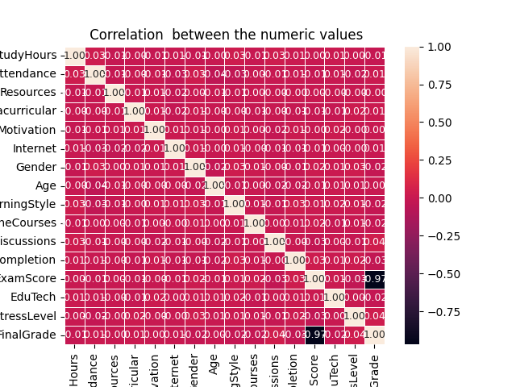
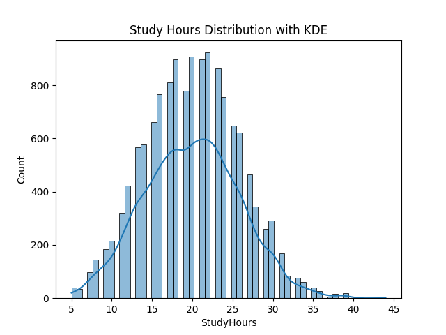

# 📊 Student Performance Analysis (EDA Project)

## 📌 Overview

This project is a simple **Exploratory Data Analysis (EDA)** on a student performance dataset. I explored how different factors like study hours, attendance, stress level, internet access, and online courses affect students’ exam scores and final grades.
The main goal was to understand the data better and find patterns using visualizations.

I also genuinely enjoyed working with Seaborn in this project — it made exploring relationships between variables really easy and fun.

---

## 📂 Dataset

The dataset (`student_performance.csv`) includes Study Hours, Attendance, Exam Score, Final Grade, Gender, Stress Level, Internet Access, Online Courses, and Assignment Completion.

---

## 🛠️ Tools used

- Python 🐍
- Pandas 📊
- NumPy 🔢
- Matplotlib 📈
- Seaborn 🌊

---

## 📊 Visualizations

Here is some of the key visualizations from the project:

Other plots include:
Study Hours vs Exam Score (Hexbin plot), Attendance vs Exam Score, Online Courses vs Exam Score, Stress Level vs Exam Score (Box plot), Internet Access vs Exam Score (Box plot), Final Grade distribution (Count plot).

---

## 🚀 How to run

git clone https://github.com/singhjiya456789/student-performance

pip install pandas numpy matplotlib seaborn  
python main.py

---

## 🎯 What I learned

- Data cleaning,
- Exploratory data analysis
- Data visualization using Seaborn and Matplotlib
- finding patterns in real-world datasets.

---

## 📌 Next steps

- Build a Streamlit dashboard
- Apply machine learning to predict exam scores
- Make visualizations interactive.

---

## 👨‍💻 Author

**Jiya Singh**

Computer Engineering Student

Interested in:

- Data Science
- Data Analytics
- Python
- ML

---

⭐ If you found this project useful, consider giving the repository a star!
